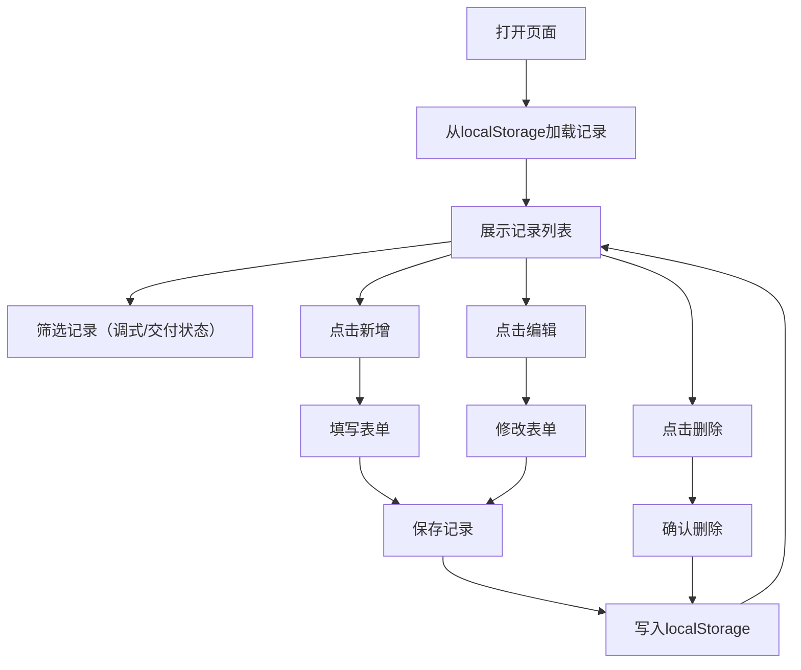

## 1. 产品概述

手碟调音记录管理系统，为手碟调音师提供个人工作记录工具，记录每只手碟的音阶配置和调音状态，支持完整的增删改查和筛选功能，数据本地存储，即开即用。

- 解决问题：调音师需要系统化记录每只手碟的调音历史和状态，避免纸质记录的不便
- 目标用户：专业手碟调音师，个人日常使用
- 产品价值：轻量化、离线可用、数据持久化的专业调音记录工具

## 2. 核心 Features

### 2.1 用户角色
| 角色 | 注册方式 | 核心权限 |
|------|----------|----------|
| 调音师 | 无需注册，本地使用 | 记录的完整增删改查、筛选、数据导入导出 |

### 2.2 Feature 模块
1. **记录列表页**：记录卡片展示、筛选工具栏、新增按钮、分页/滚动
2. **记录表单弹窗**：新增/编辑记录的表单输入
3. **数据管理**：localStorage 持久化、数据导入导出（可选）

### 2.3 页面详情
| 页面名称 | 模块名称 | 功能描述 |
|---------|----------|----------|
| 记录列表页 | 顶部标题栏 | 应用名称、数据导出按钮 |
| 记录列表页 | 筛选工具栏 | 调式筛选下拉、交付状态筛选下拉、搜索框 |
| 记录列表页 | 记录卡片列表 | 每条记录的完整信息展示，包含编辑和删除操作 |
| 记录列表页 | 新增按钮 | 悬浮固定按钮，点击打开新增表单 |
| 记录表单弹窗 | 表单输入 | 编号、调式、音位数量、最近调音日期、偏音说明、客户昵称、交付状态 |
| 记录表单弹窗 | 操作按钮 | 保存、取消 |

## 3. 核心流程

用户打开页面 → 查看已有记录列表 → 根据调式或交付状态筛选记录 → 点击新增按钮填写表单 → 保存后自动刷新列表 → 可编辑或删除任意记录 → 所有操作自动同步到本地存储

## 4. 用户界面设计

### 4.1 设计风格
- **美学方向**：温暖有机/手工艺风格，呼应手碟乐器的艺术属性
- **主色调**：深陶土棕 (#8B5A2B) 为主，暖米白 (#F5F0E8) 为底
- **点缀色**：铜金色 (#B8860B) 用于强调，深墨蓝 (#2C3E50) 用于文字
- **按钮风格**：圆润边角，微立体阴影，悬停时有轻微上浮效果
- **字体**：标题用 'Playfair Display' 衬线字体，正文用 'Lora' 优雅衬线体
- **布局风格**：卡片式瀑布流布局，卡片有细微纹理和柔和阴影
- **图标风格**：使用简约线性图标，配合乐器相关的视觉元素
- **背景**：带有轻微纸张纹理的暖米白色背景

### 4.2 页面设计概览
| 页面名称 | 模块名称 | UI 元素 |
|---------|----------|----------|
| 记录列表页 | 顶部标题栏 | 大字号衬线标题，铜金色分割线，右侧导出按钮 |
| 记录列表页 | 筛选工具栏 | 横向排列的筛选下拉框，优雅的边框样式 |
| 记录列表页 | 记录卡片 | 每个卡片有编号标签、调式徽章、音位数量、日期、客户昵称、交付状态标签、偏音说明文本区、右下角编辑删除按钮 |
| 记录列表页 | 新增按钮 | 右下角固定悬浮按钮，铜金色圆形加号按钮 |
| 记录表单弹窗 | 表单 | 半透明遮罩，居中白色卡片，表单标签左对齐，输入框优雅边框 |

### 4.3 响应式
- 桌面端：3列卡片布局，筛选栏水平排列
- 平板端：2列卡片布局
- 移动端：1列卡片布局，筛选栏垂直堆叠
- 所有交互元素确保触摸友好，最小点击区域 44x44px

### 4.4 动效设计
- 页面加载：卡片依次淡入，带有轻微的垂直位移
- 卡片悬停：轻微上浮 + 阴影加深
- 弹窗出现：缩放 + 淡入效果
- 按钮点击：轻微按压反馈
- 删除操作：卡片淡出 + 相邻卡片平滑重排
