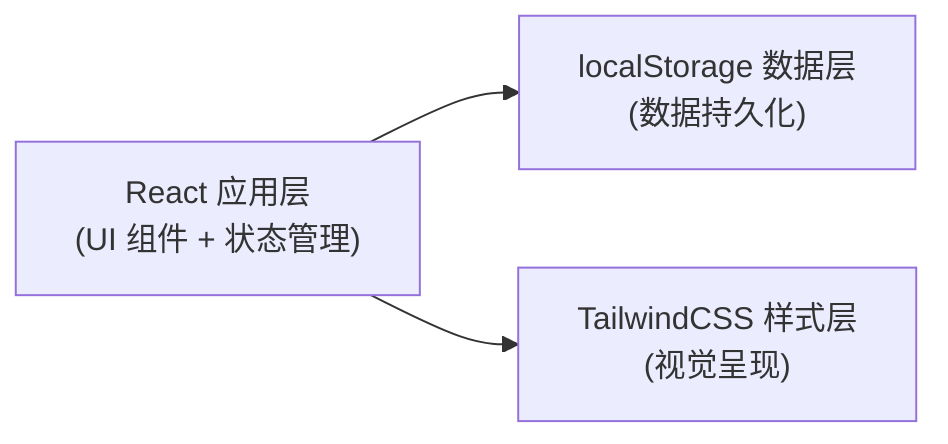
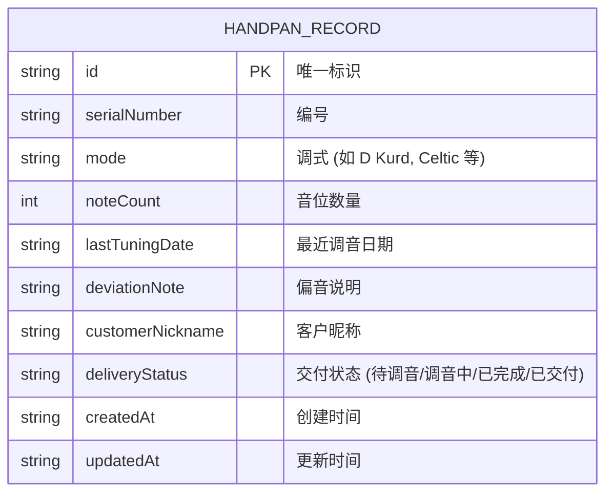

## 1. 架构设计



## 2. 技术描述

- **前端框架**: React@18 + TypeScript
- **构建工具**: Vite@5
- **样式方案**: TailwindCSS@3
- **数据存储**: 浏览器 localStorage（无需后端）
- **图标库**: lucide-react（简约线性图标）
- **状态管理**: React useState/useEffect（轻量场景，无需 Redux）

## 3. 目录结构

```
src/
├── types/
│   └── record.ts          # 类型定义
├── hooks/
│   └── useLocalStorage.ts # localStorage 自定义 Hook
├── components/
│   ├── Header.tsx         # 顶部标题栏
│   ├── FilterBar.tsx      # 筛选工具栏
│   ├── RecordCard.tsx     # 记录卡片
│   ├── RecordList.tsx     # 记录列表
│   ├── RecordForm.tsx     # 记录表单弹窗
│   └── FloatingButton.tsx # 悬浮新增按钮
├── utils/
│   └── storage.ts         # localStorage 工具函数
├── App.tsx                # 主应用组件
├── main.tsx               # 入口文件
└── index.css              # 全局样式 + Tailwind
```

## 4. 数据模型

### 4.1 数据模型定义



### 4.2 类型定义 (TypeScript)

```typescript
type DeliveryStatus = 'pending' | 'in-progress' | 'completed' | 'delivered';

interface HandpanRecord {
  id: string;
  serialNumber: string;
  mode: string;
  noteCount: number;
  lastTuningDate: string;
  deviationNote: string;
  customerNickname: string;
  deliveryStatus: DeliveryStatus;
  createdAt: string;
  updatedAt: string;
}

interface FilterState {
  mode: string;
  deliveryStatus: DeliveryStatus | '';
  search: string;
}
```

### 4.3 localStorage 键名

- 存储键: `handpan_records`
- 数据格式: JSON 数组
- 示例数据:
```json
[
  {
    "id": "uuid-1",
    "serialNumber": "HP-2024-001",
    "mode": "D Kurd",
    "noteCount": 9,
    "lastTuningDate": "2024-01-15",
    "deviationNote": "Ding 音偏低 5 音分，已校准",
    "customerNickname": "小李",
    "deliveryStatus": "delivered",
    "createdAt": "2024-01-10T10:00:00Z",
    "updatedAt": "2024-01-15T14:30:00Z"
  }
]
```

## 5. 核心功能实现

### 5.1 自定义 Hook - useLocalStorage

```typescript
function useLocalStorage<T>(key: string, initialValue: T): [T, (value: T | ((prev: T) => T)) => void]
```

### 5.2 常用调式预设

- D Kurd, D Celtic, D Integral, C# Amara, E Low Pygmy, F# Hijaz, G Golden Gate 等

### 5.3 交付状态映射

| 英文标识 | 中文显示 | 颜色 |
|---------|----------|------|
| pending | 待调音 | 灰色 |
| in-progress | 调音中 | 蓝色 |
| completed | 已完成 | 绿色 |
| delivered | 已交付 | 铜金色 |
